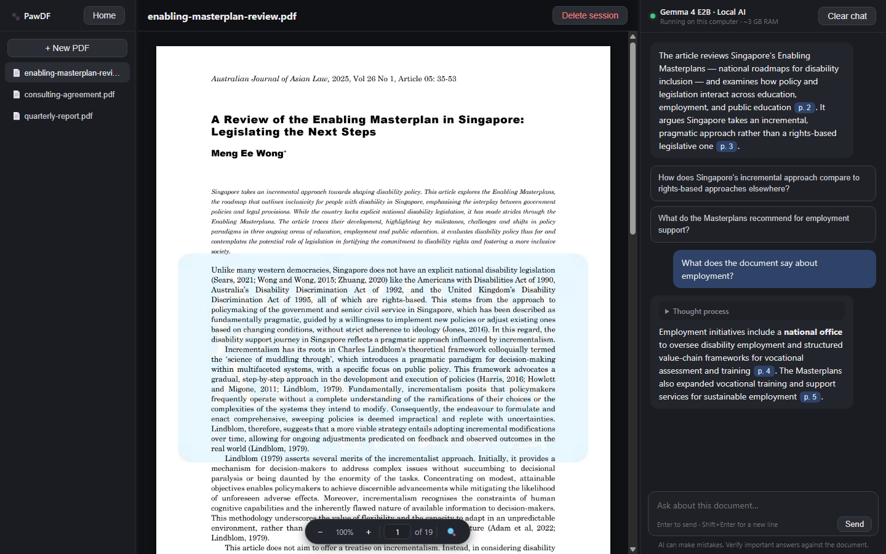

# 🐾 PawDF

Chat with your PDFs — fully local, fully offline. Inspired by NotebookLM, but everything runs on your own machine.

PawDF is a desktop app (Windows + macOS) that lets you upload a PDF and ask questions about it. Answers come from a local LLM ([Gemma 4 E2B](https://huggingface.co/unsloth/gemma-4-E2B-it-GGUF), ~3 GB) served by [llama.cpp](https://github.com/ggml-org/llama.cpp). **No cloud, no API keys, no data leaves your computer.**



📖 **[User Guide](docs/USER_GUIDE.md)** · 🚢 **[Release process](docs/RELEASING.md)** · 📝 **[Changelog](CHANGELOG.md)**

## Install

1. Download the installer for your OS from [Releases](../../releases) (`.msi`/`.exe` for Windows, `.dmg` for macOS).
2. Run it and launch PawDF.
   - **macOS:** builds are unsigned, so Gatekeeper may say the app "is damaged" or "can't be opened". Fix: `xattr -cr /Applications/PawDF.app` (or right-click the app → Open).
   - **Windows:** SmartScreen may warn about an unrecognized app. Click "More info" → "Run anyway".
3. On first launch PawDF downloads the AI model (~3 GB, one time — needs internet just that once). The llama.cpp runtime ships inside the installer. After that download, PawDF is fully offline.

## Use

See the **[User Guide](docs/USER_GUIDE.md)** for the full tour. In short:

- **Upload PDF** → creates a session (the PDF is copied into app storage, so the original can move or be deleted). New sessions open with an auto-generated summary and two clickable starter questions.
- Ask questions in the chat; the model answers only from the document, streams its reply (reasoning shown live, then folded), and cites pages as clickable chips that jump the preview to the source.
- The session view is three resizable panels: library sidebar · PDF preview (zoom, page navigator, find-with-highlights) · chat.
- Sessions auto-save after every exchange and reappear when you reopen the app.
- **Clear chat** wipes the conversation but keeps the PDF and its parsed text.
- **Delete session** removes the session, its chat, and the stored PDF copy.

Documents and chats live in the app data dir (`%APPDATA%/com.pawdf.app` on Windows, `~/Library/Application Support/com.pawdf.app` on macOS): `sessions/<id>/` (`doc.pdf`, `doc.txt`, `chat.json`, `meta.json`). The downloaded model also lives there (`models/`, ~3 GB); the llama.cpp runtime ships bundled in the installed app resources.

**Uninstalling removes the app and the bundled llama.cpp runtime; the app data dir (with the ~3 GB model and your library) is kept by default** so a reinstall is instant. The Windows `.exe` uninstaller offers a "Delete the application data" checkbox to remove it too; otherwise delete the folder manually. See [Uninstalling PawDF](docs/USER_GUIDE.md#9-uninstalling-pawdf).

## Private by design

- **Works with Wi-Fi off.** The AI runs entirely on your computer. Your documents, questions, and answers are never sent anywhere — there is nothing to send them to.
- **No accounts, no telemetry.** PawDF doesn't ask you to sign in and doesn't collect usage data.
- **Answers come from your document.** The AI is instructed to answer only from the PDF and to cite the page, so every claim is one click away from being checked. (It can still make mistakes — verify anything important.)
- **No web access, even when you're online.** The AI engine has no browsing or search capability, and the app's window is locked down (content security policy + sanitized output) so nothing in a document or an answer can trigger a web request.
- **Self-contained AI.** PawDF installs and uses its *own* copy of llama.cpp and the Gemma 4 E2B model, even if you already have them (e.g. via Ollama or LM Studio). It never touches your existing setup, and uninstalling PawDF leaves other tools untouched — the trade-off is ~3–4 GB of disk for PawDF's own copy.

## How it works

- Tauri 2 app; the Rust backend spawns `llama-server` on a random localhost port at startup and kills it on exit. The UI is blocked by a loading screen until the model reports healthy.
- **GPU accelerated where possible.** Windows builds bundle llama.cpp's Vulkan runtime, which uses any compatible GPU — including integrated graphics — and falls back to the CPU backends it also ships when there is none. macOS uses Metal. On a discrete GPU this is worth ~40x on prompt processing, which is what makes long documents practical.
- **The retrieval budget is measured, not guessed.** At boot the backend times a short prefill and the UI sizes each question's document budget from the result (~12k characters on a slow CPU, up to 90k on a GPU), so the same build stays responsive on very different hardware. The measurement is cached after the first run.
- pdf.js renders the PDF (left pane) and extracts its text once per document, tagging each page with a `[Page N]` marker.
- If the document fits the budget it is sent whole (stable prompt prefix → llama.cpp prompt cache keeps follow-ups fast). If not, it is chunked on page boundaries — every chunk keeps its own page marker, so a citation can't be attributed to the wrong page — and ranked with BM25. The opening pages (parties, dates, definitions) are always included, neighbouring chunks come along so a clause and its carve-outs stay together, and if nothing matches the question the model is told so instead of being handed the first few pages as though they were relevant.
- Query and document terms are stemmed before ranking, so "which law **governs**" finds a clause reading "**governed** by the **laws** of". The stemmer is deliberately crude — it only has to fold both sides the same way.
- The system prompt instructs the model to answer only from the document and to say so when the answer isn't there. Citations are only rendered as clickable page buttons when the page actually exists — models will otherwise cite a clause number as if it were a page.
- Model "thinking" is disabled: answering from a document is extraction, and measurements on a long contract showed reasoning made citations *less* accurate while costing 4–6x the time.
- `npm test` runs the retrieval and citation self-checks.

## Hardware

Anything that runs the model will work; the app measures its own speed at startup and adjusts how much document it sends per question, so it stays responsive rather than getting slower on weaker machines.

| Machine | What to expect on a 100–300 page contract |
| --- | --- |
| Discrete GPU (Vulkan / Metal) | Answers in ~1–3s; the largest budget (90k characters per question) |
| Laptop with integrated graphics (Intel Iris Xe, i5 9th gen+) | Answers in roughly 5–15s |
| Apple Silicon (M1 Air, 8 GB) | Comfortable — the model stack needs ~3.2 GB, since Gemma 4's sliding-window attention keeps a 32k context to ~200 MB of KV cache |
| No usable GPU at all | Works, ~15–30s per question at the minimum budget; the Vulkan build ships the CPU backends and falls back automatically |

RAM: 8 GB is enough. The model is ~2.9 GB, the runtime adds ~0.4 GB, and the app itself ~0.5 GB.

## Develop

Prereqs: Node 20+, Rust stable, and on Windows the [Tauri prerequisites](https://tauri.app/start/prerequisites/) (WebView2, MSVC build tools).

```sh
npm install
npm run tauri dev    # run the app
npm run tauri build  # produce installers in src-tauri/target/release/bundle/
```

To change the model or llama.cpp version, edit the constants at the top of `src-tauri/src/lib.rs`.

## Planned features (so far)

- Pick from multiple local models / bring your own GGUF
- BYOK support for cloud APIs (optional, off by default)
- Embedding-based retrieval, for questions phrased in words the document never uses (BM25 handles the lexical case well, which covers most contract and case-law questions)
