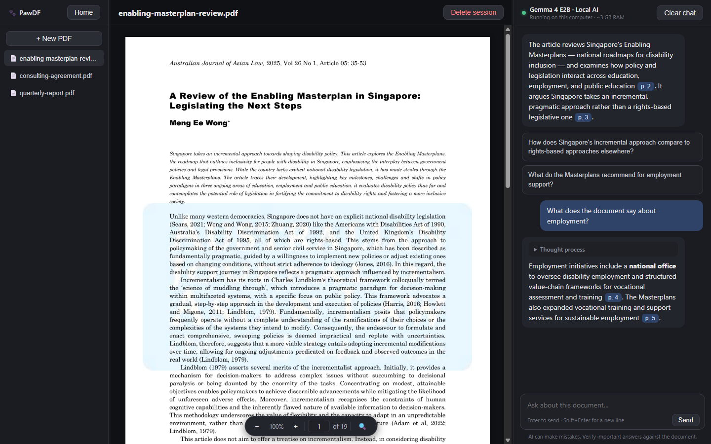
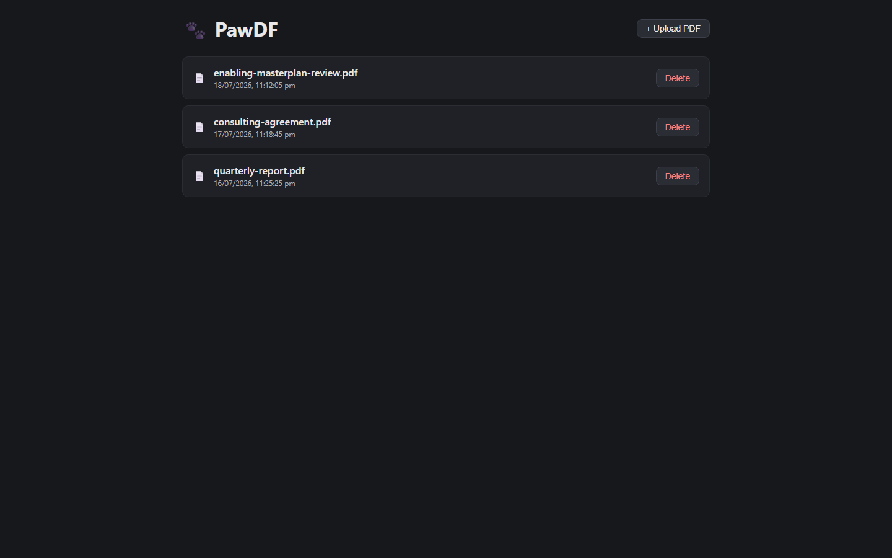
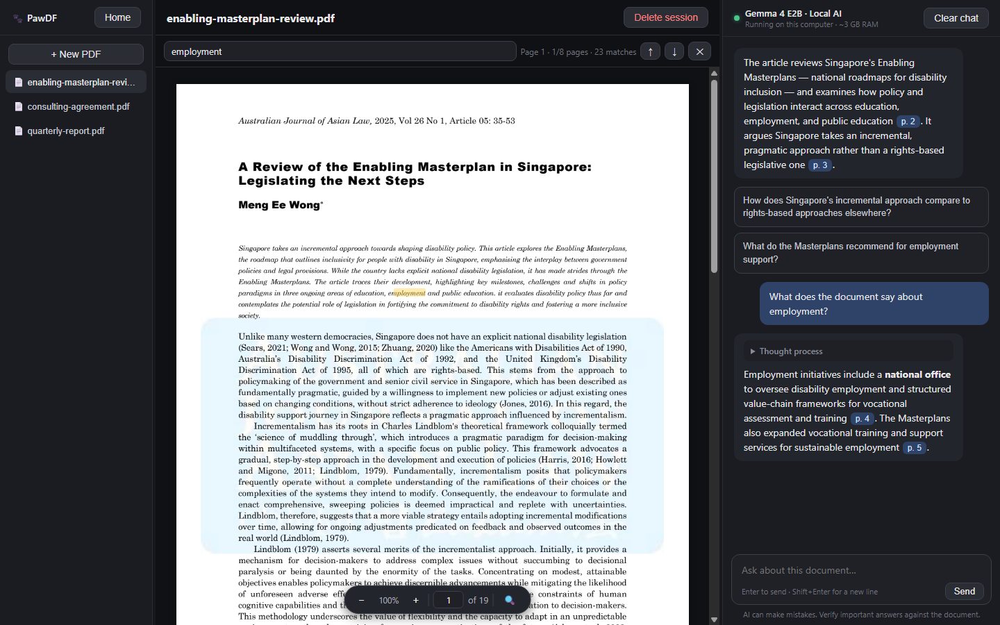

# PawDF User Guide

PawDF lets you chat with your PDFs — **fully local, fully offline**. A small AI model (Gemma 4 E2B) runs directly on your computer; your documents and questions never leave your machine.

---

## 1. Installing PawDF

1. Download the installer for your OS from the [Releases page](../../../releases):
   - **Windows:** `.msi` or `.exe`
   - **macOS:** `.dmg` (Apple Silicon and Intel builds)
2. Run the installer and launch PawDF.

Because the builds are not code-signed yet, your OS will warn you on first launch:

- **Windows (SmartScreen):** click **More info → Run anyway**.
- **macOS (Gatekeeper):** if macOS says the app "is damaged" or "can't be opened", run `xattr -cr /Applications/PawDF.app` in Terminal, or right-click the app and choose **Open**.

The installer bundles the AI model and its runtime, so the installed app works offline from its very first launch. (If you run a development build instead, the app downloads the model — about 3 GB, one time — on first start and is fully offline afterwards.)

**System requirements:** Windows 10+ or macOS, roughly 4 GB of free RAM while the app is open, and about 4 GB of disk space.

## 2. Starting up

When PawDF opens it starts the local AI and shows a loading screen until the model is ready (a few seconds on a modern laptop; the first run of a development build takes longer while the model downloads). The loading screen streams the AI engine's own startup log, so you can see progress — it is never just a blank spinner.

If startup fails you'll get an error with a **Retry** button; see [Troubleshooting](#8-troubleshooting).

## 3. Home screen — your library

The home screen lists every document you've added. Each card shows the PDF's name and when you added it.

- **+ Upload PDF** — choose a PDF to start a new session. The file is *copied* into PawDF's storage, so you can move or delete the original afterwards.
- Click a card to open that session.
- **Delete** removes the session, its chat history, and PawDF's copy of the PDF.

Every session is built around one PDF — uploading a document is what creates a session.

## 4. The session view

Opening a session shows three panels, left to right:

| Panel | What it does |
|---|---|
| **Library sidebar** | Switch to any other document, or start a new one, without leaving the view |
| **PDF preview** | The document itself, with zoom, page navigation, and search |
| **Chat sidebar** | Your conversation with the AI about this document |

Both sidebars can be **resized** — drag the thin divider on their inner edge. **Home** (top left) returns to the library.

### The PDF preview

The floating toolbar at the bottom center of the preview has everything:

- **− / +** — zoom out / in (40%–300%; 100% fits the page to the panel width). The page stays centered at any size.
- **Page number** — shows the current page as you scroll; click it, type a page number, and press Enter to jump there.
- **🔍** — find in the document (or press **Ctrl+F** / **Cmd+F**).

### Find in document

Type in the find bar and matches are **highlighted in yellow on the page itself**, live as you type. The counter shows which page you're on, how many pages have matches, and the total count. **Enter** / **Shift+Enter** (or ↑ ↓) step between matching pages; **Esc** closes the bar and clears the highlights.

## 5. Chatting with your document

When you upload a new PDF, the AI automatically:

1. **Summarizes the document** for you, with page citations, and
2. Offers **two starter questions** as clickable blocks — click one and it's asked exactly as if you typed it.

Then ask anything. Responses:

- **Stream in live**, word by word, formatted (bold, lists, tables, code).
- Show the model's **thinking** in a collapsible block while it reasons; it folds away automatically when the answer starts. Click "Thought process" to reread it later.
- Include **clickable page citations** — chips like `p. 4` that jump the PDF preview straight to the page the answer came from.

The AI answers **only from the document**. If the answer isn't in the PDF, it says so rather than guessing. Conversations are saved automatically after every exchange and are there when you come back.

- **Clear chat** wipes the conversation but keeps the PDF (a fresh summary is generated next time you open the session).
- The reminder under the input box is worth repeating here: **AI can make mistakes** — verify important answers against the document itself. The citations make that a one-click check.

## 6. The local AI — what's running on your computer

The chat header shows what's running: **Gemma 4 E2B · Local AI**. Hover it for details. In plain terms:

- A small AI model (Google's Gemma 4 E2B, ~3 GB) runs **on your computer**, powered by [llama.cpp](https://github.com/ggml-org/llama.cpp).
- While PawDF is open it uses about **3 GB of RAM** and some CPU when generating answers.
- It starts when PawDF starts and **stops completely when you close the app** — nothing keeps running in the background.
- **No internet is used** for answering questions. Nothing you upload or ask leaves your device.

## 7. Where your data lives

Everything is stored in PawDF's app-data folder:

- **Windows:** `%APPDATA%\com.pawdf.app`
- **macOS:** `~/Library/Application Support/com.pawdf.app`

Inside: `sessions/<id>/` holds each session's `doc.pdf` (your copy), `doc.txt` (extracted text), `chat.json` (conversation), and `meta.json`. Development builds also keep the downloaded model in `models/` and the AI runtime in `bin/`. Deleting this folder resets PawDF completely.

## 8. Troubleshooting

**The loading screen fails or hangs**
- Click **Retry** first.
- Check the logs in the app-data folder (paths above): `llama-server.log` is the AI engine's own output; `health.log` records why startup checks failed.
- On a development build, a failed first-run download usually means a network issue — Retry resumes it.

**"Setup failed: download of … failed"** — the one-time model download needs internet; check your connection and Retry. After that download, PawDF never needs internet again.

**Answers are slow** — the model reasons before it answers (you'll see the Thinking block streaming). Speed depends on your CPU; closing other heavy apps helps. Long documents also take longer on the first question than on follow-ups.

**The AI gave a wrong answer** — it can happen; that's why citations exist. Click the page chip and check the source. Rephrasing the question more specifically usually helps.

**Reset everything** — quit PawDF and delete the app-data folder listed in section 7.

## 9. FAQ

**Is it really offline?** Yes. The only network use ever is downloading the model on a development build's first launch. Installed releases ship with the model included and work offline from the first run.

**Can I use a different model?** Not from the UI yet — it's on the roadmap (multiple models, bring-your-own GGUF, optional cloud APIs). Developers can change the pinned model constant in `src-tauri/src/lib.rs`.

**What PDFs work?** Text-based PDFs work best. Scanned/image-only PDFs render fine in the preview, but there is no OCR yet, so the AI can't read them.

**How big can the PDF be?** Any size renders. For very long documents the AI selects the most relevant sections per question, so pinpoint questions work better than "summarize everything" on a 500-page book.
